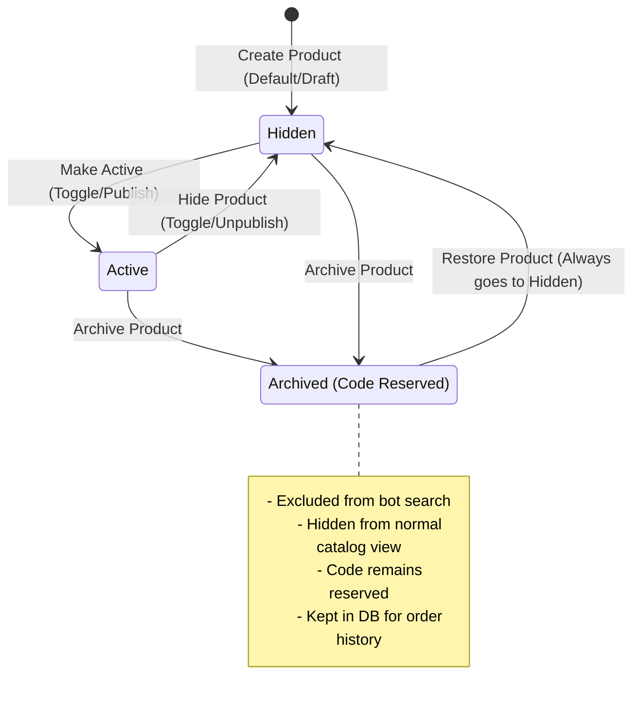
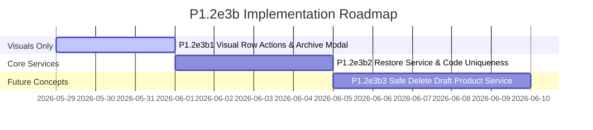

# Product Lifecycle UX Policy (P1.2e3b)

This document establishes the official Product Lifecycle UX Policy for the `chatbot-fanpage` catalog management dashboard under project slice **P1.2e3b**. 

This policy ensures database integrity, maintains historical accuracy for older orders and messages, and provides a safe, intuitive workflow for operators managing shop products without risking broken customer experiences or database referential integrity errors.

---

## 📋 Executive Summary of Approved Decisions

1. **Archived Product Codes Remain Reserved**: Product codes (e.g. `M10`) of archived products remain strictly reserved within the same shop to prevent historical data mismatch.
2. **Restore Archived Product to Hidden**: Restoring an archived product transitions it to the `hidden` status, never directly to `active`.
3. **Hard-Delete is a Future-Only Concept**: Physical database deletion is deferred to a future concept (**P1.2e3b3**), limited strictly to clean, unreferenced draft products. No hard-deletes are allowed in **P1.2e3b1**.
4. **Visual-Only Visual Polish (P1.2e3b1)**: The initial slice is visual-only, utilizing existing routes and UI elements with no production database or API modifications.
5. **Zero Production Risk**: No production environment changes, DB schema updates, or external integrations (Meta Graph API / Messenger) are deployed in this phase.

---

## 🔄 Product State & Lifecycle Definition

Products in the catalog can exist in one of three statuses. Each status dictates how the product behaves in front-end admin views and customer-facing chatbot interactions.

### 1. Active State
* **Meaning**: The product is fully published, in stock, and active.
* **Chatbot Visibility**: The chatbot matches this product's code (e.g., when a user types `M10`) and displays it in search/catalog queries.
* **Admin Visibility**: Displays in the main products table with an `Active` (Hoạt động) badge.
* **Operations**: Supports all editing, image updates, and status toggling operations.

### 2. Hidden State
* **Meaning**: The product is saved in the database but temporarily hidden or out of stock.
* **Chatbot Visibility**: The chatbot ignores this product during customer catalog browsing and code search queries.
* **Admin Visibility**: Displays in the main products table with a `Hidden` (Tạm ẩn) badge.
* **Operations**: Supports all editing operations. Operators can toggle a hidden product to `Active` to resume customer-facing sales instantly.

### 3. Archived State
* **Meaning**: The product is soft-deleted/archived. It represents a retired or historically discontinued product.
* **Chatbot Visibility**: Completely hidden from the customer-facing chatbot.
* **Admin Visibility**: Excluded from the main products table. Viewable only when explicitly filtering for archived items.
* **Operations**: Product details are read-only. The only permitted action is **Restore** (which returns the product to the `Hidden` state).

---

## 🛡️ Product Code Historical Policy

Product codes (such as `M10`, `S22`) serve as unique identifiers matched by the chatbot natural language processor to trigger instant product info cards in chat threads.

> [!IMPORTANT]
> **Code Reservation Guarantee**
> - **Rule**: Once a product code is created and saved, it remains **exclusively reserved** for that specific product, even if the product is moved to the **Archived** status.
> - **Reasoning**: This prevents duplicate-code collisions, maintains clean referential statistics for past order analytics, and ensures that restoring an archived product does not create runtime database constraint violations if another product has taken the code.
> - **Validation**: The system must enforce that no two products in the same shop (whether Active, Hidden, or Archived) can share the same product code.

---

## 🔀 Actions: Archive vs. Hidden vs. Restore

The following matrix defines the UI controls, state transitions, and business logic for managing product visibility:

| Action | Source Status | Target Status | Chatbot Behavior | DB / Code Impact | Operator UX Impact |
| :--- | :--- | :--- | :--- | :--- | :--- |
| **Hide / Disable** | `Active` | `Hidden` | Bot stops displaying the product. | Retains code. Code remains reserved. | Product stays in the main table with a warning badge. Easy to turn back on. |
| **Show / Enable** | `Hidden` | `Active` | Bot instantly starts serving the product. | Retains code. Code remains reserved. | Product status turns green. |
| **Archive** | `Active` / `Hidden` | `Archived` | Bot stops displaying the product. | Retains code. Code remains reserved. | Product disappears from the active list. Archived items can only be seen via the "Archived Products" filter. |
| **Restore** | `Archived` | `Hidden` | Bot remains unaware of it (hidden). | Retains code. Code remains reserved. | **Safety Net**: Product is restored safely as `Hidden`. Operators must review/edit it before manually making it `Active`. |

---

## 🔮 Hard-Delete Draft Product: Future Policy (P1.2e3b3)

To maintain a clean catalog database, a physical deletion capability is proposed as a **future concept only** (not included in the initial UI slice).

> [!WARNING]
> **Strict Guardrails for Hard Deletion**
> Hard deletion (permanent database record destruction) will be strictly gated and allowed **only** under the following cumulative conditions:
> 1. The shop must be in `Draft` or `Configuring` mode.
> 2. The product must have **zero** historical relationships:
>    - No references in `orders` or `order_items` tables (even incomplete/draft orders).
>    - No occurrences in customer chat histories or analytics events.
> 3. The operator must confirm the permanent deletion via a high-friction confirmation dialog (e.g. typing "DELETE" or confirming a double-check warning).

If any of these conditions are not met, the UI will disable the hard-delete action and prompt the user to **Archive** the product instead.

---

## 🚀 Implementation Slices & Milestones

The feature rollout is organized into three progressive, safe development phases:

### 1. Slice P1.2e3b1: Visual Row Actions & Archive Modal (Visual-Only)
* **Scope**: UI-only updates inside `core/admin/views.js`.
  - Add compact "Archive" icon buttons and "Status Toggles" in the catalog table.
  - Implement a premium confirmation modal for archiving products.
  - **No backend changes**: Reuses existing archive/status update routes.
* **Safety**: Fully static and visual, with absolutely zero risk of production regression or database downtime.

### 2. Slice P1.2e3b2: Restore Service & Archive-Aware Code Uniqueness
* **Scope**: Backend API & service enhancements.
  - Create `/admin/products/:id/restore` endpoint that updates the status to `hidden`.
  - Update backend validation schemas to check for duplicate codes against *all* products in the shop, including archived ones.
  - Enable frontend "Archived Products" toggle/filter in the catalog toolbar.

### 3. Slice P1.2e3b3: Safe Delete Draft Product Service (Future Concept)
* **Scope**: Conditional hard-deletion service.
  - Develop the `safeDeleteProduct` database constraint checker.
  - Integrate visual error states notifying operators why a deletion was blocked and offering archive alternatives.
  - *Note: This slice will only be implemented after explicit stakeholder approval.*

---

## 🛑 Verification & Compliance Standard

Before any code deployment for subsequent phases, developers must ensure:
- [ ] Running `git diff --check` returns zero whitespaces or formatting issues.
- [ ] No direct updates are performed on the production database without migrations.
- [ ] Existing endpoints retain their legacy behaviors to ensure compatibility with active webhooks.
