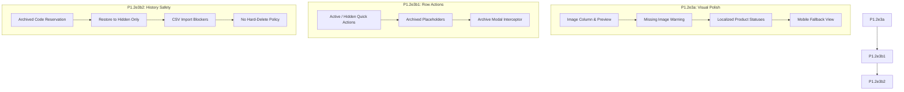
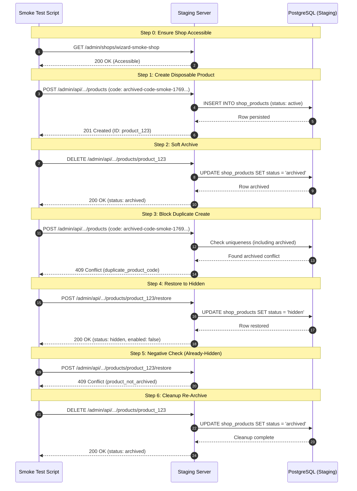

# Product Lifecycle & Visual Polish Checkpoint (P1.2e3)

This checkpoint document details the successful implementation, testing, staging deployment, and validation of the visual catalog polish and lifecycle safety controls under the **P1.2e3** feature suite. 

---

## 📋 Phase Summary

The **P1.2e3** milestone establishes professional-grade visual enhancements for catalog operators and guarantees absolute data safety for product codes. It bridges client-side usability improvements with robust backend enforcement to prevent catalog regressions and historical order mismatch errors.

---

## 🎨 1. P1.2e3a Product Image & Status Visual Polish

This phase introduces an image-first visual standard to catalog tables, ensuring operators have clear visibility of product assets and warnings for missing data.

* **Commit**: `2dbd193`
* **Staging Deployment ID**: `72d569f2-19d7-4592-a662-176924952831`

### Key Deliverables Completed:

1. **"Ảnh" (Image) Table Column**:
   - Integrated a high-fidelity image thumbnail preview directly into the product catalog table row.
   - Active, linked product image assets (type `product_image`) are fetched and rendered as a compact `48x48px` preview with rounded corners (`border-radius: 6px`) and an explicit `object-fit: cover` styling.
   - Features an inline `onerror` fallback mechanism to catch broken asset links gracefully, hiding the broken image and displaying a red warning label (`Lỗi ảnh`).

2. **Missing Image Safety Warning**:
   - **Active Products**: If an active product does not have any active linked image asset, the system displays a prominent yellow/amber warning card in the table row:
     - Stylized using clear, harmonious colors: `background: #fffbeb`, `border: 1px dashed #f59e0b`, `color: #b45309`.
     - Displays a `⚠ Thiếu ảnh` warning label to grab operator attention before customer-facing deployment.
   - **Draft/Hidden Products**: For inactive products with no image, the system renders a clean, subtle grey placeholder card featuring a standard image emoji (`🖼️` with `background: #f1f5f9`, `border: 1px dashed #cbd5e1`, `color: #64748b`).

3. **Localized Product Statuses**:
   - Product status badges are fully localized into Vietnamese to match the operator's runtime interface:
     - **Active** translates to `Hoạt động` (green/success status styling).
     - **Hidden** translates to `Tạm ẩn` (amber/warning status styling).
     - **Archived** translates to `Đã lưu trữ` (grey/muted status styling).
   - This ensures full alignment with the [Product Lifecycle UX Policy](../../architecture/product-lifecycle-ux-policy.md).

4. **Mobile Responsive Fallback**:
   - Implemented a complete card-based fallback system optimized for mobile views.
   - Renders products as high-quality visual list cards (instead of tables) on smaller screens, retaining image previews, product code indicators, prices, localized status badges, and quick operator actions.

---

## ⚡ 2. P1.2e3b1 Product Lifecycle Row Actions

This phase optimizes operator catalog workflows with instant quick-action controls and high-fidelity confirmation safety nets.

* **Commit**: `94b0915`
* **Staging Deployment ID**: `aaa77674-c28f-4a23-a7f3-786b61e0b37b`

### Key Deliverables Completed:

1. **Active Row Quick Actions**:
   - Active product rows display clear actions:
     - **Tạm ẩn**: Toggles the product to the hidden state, instantly removing it from the customer-facing chatbot searches while keeping its code reserved.
     - **Lưu trữ**: Prompts the archive workflow.

2. **Hidden Row Quick Actions**:
   - Hidden/disabled product rows display:
     - **Hiện lại**: Toggles the product state back to `active` (Hoạt động) instantly.
     - **Lưu trữ**: Prompts the archive workflow.

3. **Archived Row Placeholders**:
   - Archived products remain read-only.
   - The **Sửa** (Edit) action button is hidden.
   - Quick-action buttons render disabled placeholders to guide operators:
     - **Khôi phục**: Disabled placeholder (fully activated in P1.2e3b2).
     - **Xóa nháp**: Disabled placeholder (reserved exclusively for draft products without historical references in a separate phase).

4. **Premium Archive Interceptor Modal**:
   - Implemented a standard-compliant confirmation modal (`#product-archive-modal`) that intercepts the archiving action.
   - Renders a secure overlay backdrop demanding confirmation before soft-archiving, informing operators that archiving hides the product from active sales but permanently reserves its code to preserve past order analytics and message histories.

---

## 🛡️ 3. P1.2e3b2 Product Code History Safety

This phase implements robust database-level constraints and validation schemas to secure the product code historical namespace.

* **Commit**: `d545b4a`
* **Staging Deployment ID**: `3a1b47c3-20df-4521-98c3-7f976c74abfb`

### Key Deliverables Completed:

1. **Archived Code Reservation**:
   - Product codes (e.g. `M10`) of archived products remain strictly reserved in the shop's namespace.
   - Prevents duplicate-code collisions and ensures database referential integrity for older customer orders, analytics logs, and chat threads.

2. **Safe Restore-to-Hidden Transition**:
   - The `/admin/api/shops/:shopId/products/:productId/restore` endpoint transitions an archived product strictly to `hidden` status (status maps to `hidden`, `enabled` maps to `false`).
   - Restoring a product **never** publishes it directly back to `active` (live).
   - This creates an essential operator safety buffer, requiring the merchant to explicitly review and edit the restored catalog item before manually toggling it back to active.

3. **Creation/Duplication Block**:
   - Attempting to create or update a product with a code already in use by *any* product (Active, Hidden, or Archived) in the same shop is blocked at the transaction level.
   - Returns a clear, localized Vietnamese validation message:
     > `"Mã sản phẩm này đã tồn tại trong shop, kể cả sản phẩm đã lưu trữ. Hãy dùng mã khác hoặc khôi phục sản phẩm cũ."`

4. **CSV Import Safety Guard**:
   - The bulk CSV import service checks imported product codes against all active, hidden, and archived products.
   - If a code in the CSV collides with an archived product, the import is safely failed.
   - Renders a clean `archived_product_code` error on the affected row, suggesting the standard fix:
     > `"This code belongs to an archived product. Restore that product from the catalog instead of importing, or use a different code."`
   - This guarantees that a bulk import can never silently overwrite, corrupt, or resurrect archived catalog items.

5. **No Hard-Delete Policy**:
   - Physical database row deletions for products are strictly blocked in this slice, ensuring that historical relationships are preserved and that the soft-archive standard is consistently enforced.

---

## 🧪 4. Staging Smoke Test Verification

A comprehensive, isolated E2E staging smoke test was executed against the staging environment (`https://chatbot-fanpage-staging-staging.up.railway.app`) to verify these lifecycle safety guards under real-world conditions.

### Test Execution Walkthrough:

### Staging Verification Results:

1. **Safety Boundary Adhered**:
   - The staging test utilized a unique, timestamp-based disposable product code (`archived-code-smoke-${timestamp}`) to guarantee zero namespace contamination.
   - The test was executed exclusively on the disposable `wizard-smoke-shop` config.
   - **Protected Shops Untouched**: Live configurations and catalogs for `adult-shop`, `demo-shop`, and `nem-bui-xa` were completely untouched, satisfying strict staging-isolation rules.

2. **Database Duplicate Count Verification**:
   - **Zero Redundant Rows**: During Step 3 (duplicate block), the duplicate creation request was immediately blocked by the backend API.
   - **Zero Database Resurrections**: No duplicate or new product rows were added to the database. The original archived row remained isolated and completely unaffected.

3. **Negative Constraint Validation**:
   - Attempting to restore a product that was already in a `hidden` (non-archived) state correctly threw a `409 Conflict` error with code `product_not_archived`, verifying that the state machine holds correct validations.

4. **Cleanup Integrity**:
   - The smoke product was safely returned to the `archived` state at the end of the test to maintain a pristine staging catalog database, with no hard-deletes or database cleanup bypasses.
