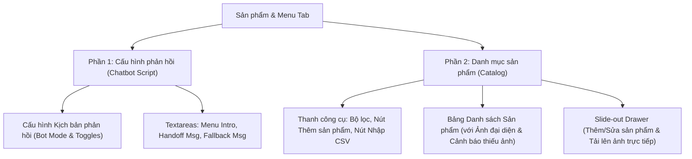
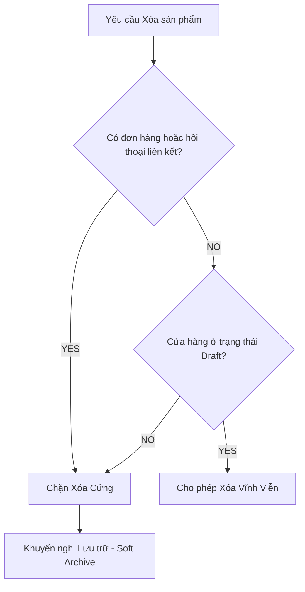

# UX Design & Polish Plan: Products & Catalog Management (P1.2e)

This design blueprint outlines the UX audit, visual redesign, and implementation plan for the **Sản phẩm & Menu (Products & Menu)** admin dashboard tab in the `chatbot-fanpage` platform.

The primary goal is to empower non-technical operators to configure bot responses, add/edit catalog items, upload media assets, and import CSV bulk data quickly and safely without understanding database schemas or technical terminology.

---

## 1. 🔍 UX Diagnosis: Friction Points & Technical Clutter

Our audit of [views.js](file:///c:/Users/Pc/Desktop/New%20folder/chatbot-fanpage/core/admin/views.js) and the current layout reveals several significant friction points:

### ⚠️ A. Technical Clutter & Cognitive Load
- **Inline Editing Overhead**: The current product edit form is rendered directly inside a table cell for every single row. Staggering multiple compact forms vertically stretches the table, causes visual noise, and breaks layout alignment.
- **Abstract Checkboxes**: Configuration options like `handoff_enabled` and `productCodeLookupEnabled` are presented as raw checkbox lists without visual aids showing how they affect the customer's chat experience.
- **Technical Fields Exposed**: Fields like `sort_order` and `category` confuse operators, who usually think in terms of display order and product tags. Raw JSON blocks are displayed in full, causing unnecessary cognitive load.

### 🛑 B. High Risk of Operator Errors
- **Duplicate/Invalid Codes**: Product codes must be strictly unique (e.g. `M10`), but there is no real-time validation when typing a code. An operator might accidentally input duplicate or space-padded codes (e.g. `M10 ` vs `m10`), leading to chatbot reply conflicts.
- **Blind Bulk CSV Import**: The current bulk import form requires copy-pasting raw CSV text into a large textarea. If the CSV has syntax errors or duplicate codes, the operator gets a raw database error instead of clean column-by-column visual validation.
- **Disconnected Product Media**: Currently, adding a product and uploading its image are located on two entirely separate tabs (`Sản phẩm & Menu` and `Hình ảnh`). Operators must add a product, switch tabs, search for the product code, and then upload/import the image. This disconnect often results in products missing images.

---

## 2. 🗺️ Proposed Products & Menu Layout (Visual Mockup)

The redesigned tab merges catalog management and response scripting into a logical visual flow split into two clearly demarcated sections:



### Layout Elements:

1. **Top Status Summary (Chatbot Script)**
   - A modern, two-column responsive grid matching the glassmorphic aesthetics.
   - **Left Column**: Response Script Textareas (Menu Intro Text, Handoff Message, Fallback Text) styled with visual placeholders and character counters.
   - **Right Column**: Interactive Rule Toggles styled as clean switch sliders, grouping logical switches (e.g., enabling product lookup automatically expands options for menu sending).
2. **Bottom Catalog Management (Products Grid)**
   - **Action-Packed Toolbar**: Responsive filter controls, with two premium, colored buttons:
     - `+ Thêm sản phẩm` (Primary Accent Blue, triggers the slide-out drawer).
     - `📥 Nhập hàng loạt từ CSV` (Secondary Outline Blue, triggers the CSV modal).
   - **Premium Product Table**: A table featuring high-contrast typography, bold status badges, product code highlights, thumbnail image previews, and orange alert tags.

---

## 3. ✍️ Recommended Editing Model: Slide-out Drawer

Rather than stretching the table with inline forms, we propose migrating to a **Slide-out Drawer** editing model.

> [!TIP]
> **Why a Drawer?**
> A slide-out drawer slides from the right side of the screen over the table. It provides a spacious, dedicated form workspace for entering descriptive copy and tags, while preserving the operator's context (the table stays visible underneath).

```
+-----------------------------------------------------------+ [X] Đóng
|  QUẢN LÝ SẢN PHẨM: THÊM / CẬP NHẬT                        |
|  -------------------------------------------------------  |
|  * Mã định danh (Product Code)  [ Hỗ trợ tự động: e.g. M10 ]|
|  [ M10                                                  ] |
|                                                           |
|  * Tên sản phẩm (Title)                                    |
|  [ Váy Hoa Voan Trắng                                   ] |
|                                                           |
|  * Giá hiển thị (Price)                                   |
|  [ 350.000đ                                             ] |
|                                                           |
|  * Hình ảnh sản phẩm (Product Media)                      |
|  +---------------------------+  [ Chọn ảnh hoặc kéo thả ] |
|  | [Thumbnail Preview]       |  (Tự động liên kết         |
|  | (Click để thay đổi)       |   với shop_assets)         |
|  +---------------------------+                            |
|                                                           |
|  * Mô tả chi tiết (Description)                           |
|  [ Váy voan tơ mềm mại, phù hợp dạo phố...              ] |
|                                                           |
|  [ Lưu thông tin ]                            [ Hủy bỏ ]   |
+-----------------------------------------------------------+
```

### Direct Upload Integration:
- The Drawer integrates a **direct file drag-and-drop area** for the product's image.
- When an operator drops an image, the system automatically uploads it and associates it as a `product_image` asset with the corresponding `product_code`, eliminating the need to use the `Hình ảnh` tab.

---

## 4. 📊 Product Table Improvements

The product table receives a premium structure, providing instant feedback on catalog health at a single glance:

| Cột | Hiển thị & Kiểu dáng | Lợi ích cho Operator |
| :--- | :--- | :--- |
| **Mã Code** | Badge dạng bo góc lớn, nền xám đậm chữ trắng: `code { font-weight: bold; background: #e2e8f0; padding: 4px 8px; border-radius: 6px; }` | Nổi bật mã code định danh mà khách cần gõ để chatbot nhận diện. |
| **Hình Ảnh** | **Ảnh Thumbnail thực tế (48x48px)** bo góc tròn. Nếu chưa có ảnh, hiển thị placeholder màu cam kèm nhãn: `⚠ Thiếu ảnh` | Phát hiện ngay sản phẩm nào chưa có hình ảnh phản hồi cho khách. |
| **Sản Phẩm** | Tên sản phẩm chữ đậm, bên dưới là mô tả tóm tắt được cắt ngắn (`limitText(desc, 60)`) chữ mờ màu xám. | Nhận diện sản phẩm nhanh chóng. |
| **Giá Bán** | Nhãn dạng tag màu lục dịu mát (e.g. `350k` hoặc `150.000 VND`). | Nhìn rõ thông tin giá tiền. |
| **Trạng Thái**| Badge trạng thái màu sắc hài hòa: xanh lá cho `Hoạt động` (Active), vàng cho `Tạm ẩn` (Hidden). | Biết ngay sản phẩm nào đang tắt/mở với bot. |
| **Hành Động** | Nút bấm nhanh (Quick action icon buttons): **Ẩn/Hiện** nhanh, **Lưu trữ** (Archive), và **Sửa** (Edit - triggers Drawer). | Thao tác tức thì mà không cần mở form phức tạp. |

---

## 🛡️ 5. Safe Archiving & Deletion Policies

Admin users must be protected from accidentally deleting products that are referenced in active customer orders or message histories.

### 🚫 Safety Guardrails & Validation Checklists



> [!IMPORTANT]
> **Safe Deletion Policy Rules**:
> 1. **Deactivate/Archive by Default**: The default delete option is always **Lưu trữ (Soft-Archive)**. Soft-archiving hides the product from the chatbot's catalog lookup but preserves the product's database record to maintain historical orders consistency.
> 2. **Block Deletion on Historical Data**: If a product has *any* foreign key linkages or references inside `orders` (even draft/incomplete checkout checkouts) or `messages`/`events` histories, hard deletion is strictly **blocked**.
> 3. **Draft Shop Exception**: Hard-delete is allowed *only* when the shop is in `draft` or `configuring` status, and the product has no order draft records whatsoever.

---

## 🎨 6. Premium Empty & Error States

To prevent user frustration, common error scenarios are caught early and displayed beautifully:

### A. Empty Catalog State
- **Illustration**: Sleek box outline graphic.
- **Action Button**: Large `+ Thêm sản phẩm đầu tiên` button centered inside the card.
- **Copy**: *"Danh mục của bạn đang trống. Hãy thêm sản phẩm hoặc nhập file CSV để bắt đầu huấn luyện chatbot phản hồi tự động."*

### B. Duplicate Product Code Warning
- **Trigger**: Operator types a code that already exists in active products (e.g. `M10` is already assigned to "Áo thun").
- **UI Render**: Real-time red warning underneath the input:
  - `⚠ Mã sản phẩm "M10" đã được dùng cho sản phẩm "Áo thun". Vui lòng chọn mã khác.`
  - The drawer's "Save" button is disabled until corrected.

### C. CSV Preview & Syntax Validation
- Rather than throwing database transaction errors, the **Bulk Import Preview** displays a clean staging table:
  - Valid rows show a green checkmark `✓ Sẵn sàng nhập`.
  - Rows with syntax errors, empty columns, or duplicate keys display in highlighted red rows with detailed, human-readable suggestions (e.g., `Dòng 4: Thiếu mã sản phẩm (code)`).

---

## 📅 7. Implementation Roadmap & Slices

To deliver these user experience improvements smoothly, we break down the development into four sequential, low-risk implementation slices:

### 🚀 Slice P1.2e1: Products & Menu Layout Polish
- **Scope**: Reorganize the Products & Menu tab in `core/admin/views.js`. Separate Chatbot behavior settings into a card section. Redesign the catalog area to add the new toolbar (Filter form + primary blue Action Buttons).
- **Outcome**: A polished, clean visual starting layout without inline clutter.

### 🚀 Slice P1.2e2: Slide-out Product Drawer
- **Scope**: Implement the Right-side Slide-out Drawer in HTML/CSS/JS. Replace the table inline edit forms with drawer trigger links.
- **Outcome**: Table rows become extremely compact and readable, and editing feels seamless.

### 🚀 Slice P1.2e3: Dynamic Media Thumbnails & Deletion Rules
- **Scope**: Add direct image upload fields into the edit drawer. Render 48x48px image thumbnails directly in the product table row. Apply backend service checks enforcing the soft-archive policy for historical orders.
- **Outcome**: Instant visual feedback of product catalog images, with secure deletion guardrails.

### 🚀 Slice P1.2e4: CSV Local Staging Preview & Validation
- **Scope**: Rewrite the bulk import view to parse the copy-pasted CSV locally in the browser prior to submit, displaying a validated check table highlighting any errors.
- **Outcome**: Zero transaction aborts due to malformed CSV imports.

---

## 📝 8. Codex-Ready Engineering Prompts

Below are the highly structured prompts ready to copy-paste for the next coding agent to execute Slices 1 and 2:

### 🤖 Codex Prompt 1: Products & Menu Layout Polish (P1.2e1)
```markdown
Task: Implement P1.2e1 Products & Menu Layout Polish.

1. Locate `core/admin/views.js` and inspect the Products & Menu tab section inside `renderShopDetailHtml`.
2. Restructure the catalog section. Separate Chat Behavior settings into their own dedicated container card at the top.
3. Design a responsive toolbar for the Catalog area:
   - Left side: Compact filter controls (Filter form).
   - Right side: Add two prominent action buttons styled with vanilla CSS:
     - Primary Blue button: "+ Thêm sản phẩm" (should trigger #add-product-drawer).
     - Secondary Blue Outline button: "Nhập sản phẩm từ CSV" (should trigger #csv-import-modal).
4. Update the styling inside views.js layout `:root` stylesheet to include modern layouts for the catalog toolbar, switch toggles, and clean margins.
5. Do not change other tabs or service layers. Make sure all existing unit tests in `tests/admin-routes.test.js` and `npm test` continue to pass.
```

### 🤖 Codex Prompt 2: Slide-out Product Drawer & Thumbnail Column (P1.2e2)
```markdown
Task: Implement P1.2e2 Slide-out Product Drawer & Compact Column.

1. Locate `core/admin/views.js`. Refactor `renderProductEditForm` and `renderProductAddForm` to render inside drawer overlays instead of expanding table cells.
2. Implement a slide-out drawer wrapper in HTML/CSS:
   - Class name: `.drawer-overlay` (acting as backdrop) and `.drawer-container` (sliding in from the right).
   - The drawer contains the complete add/edit form with clear inputs, close button `[X]`, and submit actions.
3. Update the Product Table row builder:
   - Remove inline edit forms from the table columns.
   - Add a "Thumbnail" column at the beginning of the table. If `product.public_url` exists, render a `48x48px` image with rounded corners (`border-radius: 6px`). Otherwise, render a placeholder with an orange label `⚠ Thiếu ảnh`.
   - Update the "Hành động" (Actions) column to display compact icon buttons: quick status toggle (Enable/Disable), Archive, and Edit (triggers the Slide-out Drawer with the product data filled in).
4. Update client-side scripts inside the views template to handle opening/closing drawers smoothly using CSS classes.
5. Verify changes locally by running `npm test` to ensure zero regressions on admin routes.
```
